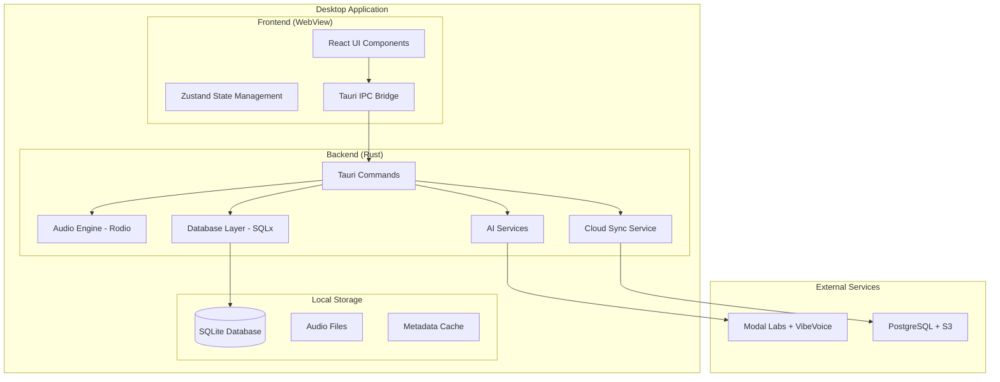

# Design Document

## Overview

AudioVibe is architected as a modern desktop application using Tauri's hybrid approach, combining a Rust backend for performance-critical operations with a React frontend for rich user interactions. The design emphasizes modularity, testability, and incremental development with continuous local testing at each phase.

## Architecture

### High-Level Architecture



### Testing Strategy Integration

Each component will be developed with accompanying tests and local validation:

1. **Unit Tests**: Rust backend components with `cargo test`
2. **Integration Tests**: Tauri command testing with mock data
3. **UI Component Tests**: React Testing Library for frontend
4. **End-to-End Tests**: Tauri's WebDriver integration
5. **Manual Testing**: Local builds with `cargo tauri dev` after each milestone

## Components and Interfaces

### 1. Tauri Application Shell

**Purpose**: Main application window and system integration

**Key Components**:
- Window management and system tray
- Auto-updater integration
- Security policy enforcement
- Native OS integration (media keys, notifications)

**Testing Approach**:
```bash
# Local testing commands
cargo tauri dev          # Development build with hot reload
cargo tauri build        # Production build testing
cargo test --manifest-path src-tauri/Cargo.toml  # Backend unit tests
```

**Interfaces**:
```rust
// src-tauri/src/main.rs
#[tauri::command]
async fn initialize_app() -> Result<AppConfig, String>

#[tauri::command] 
async fn get_system_info() -> SystemInfo
```

### 2. Audio Engine (Rust Backend)

**Purpose**: High-performance audio playback and processing

**Key Components**:
- Rodio-based audio player with async controls
- Symphonia for metadata extraction and format support
- Chapter navigation and bookmark management
- Playback state persistence

**Local Testing Strategy**:
```rust
// Test with sample audio files
#[cfg(test)]
mod tests {
    use super::*;
    
    #[tokio::test]
    async fn test_audio_playback() {
        let player = AudioPlayer::new();
        let result = player.load_file("test_assets/sample.mp3").await;
        assert!(result.is_ok());
    }
    
    #[tokio::test]
    async fn test_metadata_extraction() {
        let metadata = extract_metadata("test_assets/sample.mp3").await;
        assert!(metadata.duration > 0);
    }
}
```

**Interfaces**:
```rust
// src-tauri/src/audio/mod.rs
pub struct AudioPlayer {
    current_track: Option<Track>,
    playback_state: PlaybackState,
    volume: f32,
}

#[tauri::command]
async fn play_audio(file_path: String) -> Result<(), String>

#[tauri::command]
async fn pause_audio() -> Result<(), String>

#[tauri::command]
async fn seek_to_position(position: f64) -> Result<(), String>
```

### 3. Database Layer (SQLx + SQLite)

**Purpose**: Local data persistence and query management

**Schema Design**:
```sql
-- Core tables for local testing
CREATE TABLE audiobooks (
    id INTEGER PRIMARY KEY,
    title TEXT NOT NULL,
    author TEXT,
    file_path TEXT NOT NULL,
    duration INTEGER,
    metadata JSON,
    created_at DATETIME DEFAULT CURRENT_TIMESTAMP
);

CREATE TABLE playback_progress (
    audiobook_id INTEGER,
    position REAL,
    last_played DATETIME,
    FOREIGN KEY (audiobook_id) REFERENCES audiobooks(id)
);

CREATE TABLE collections (
    id INTEGER PRIMARY KEY,
    name TEXT NOT NULL,
    description TEXT,
    created_at DATETIME DEFAULT CURRENT_TIMESTAMP
);
```

**Testing with Sample Data**:
```rust
// Database testing setup
#[cfg(test)]
mod db_tests {
    use sqlx::sqlite::SqlitePool;
    
    async fn setup_test_db() -> SqlitePool {
        let pool = SqlitePool::connect(":memory:").await.unwrap();
        sqlx::migrate!("./migrations").run(&pool).await.unwrap();
        pool
    }
    
    #[tokio::test]
    async fn test_audiobook_crud() {
        let pool = setup_test_db().await;
        let audiobook = create_test_audiobook(&pool).await;
        assert!(audiobook.id > 0);
    }
}
```

**Interfaces**:
```rust
// src-tauri/src/database/mod.rs
pub struct AudiobookRepository {
    pool: SqlitePool,
}

#[tauri::command]
async fn get_audiobooks() -> Result<Vec<Audiobook>, String>

#[tauri::command]
async fn add_audiobook(audiobook: NewAudiobook) -> Result<Audiobook, String>
```

### 4. React Frontend Components

**Purpose**: User interface and interaction management

**Component Hierarchy**:
```
App
├── Layout
│   ├── Sidebar (Library navigation)
│   ├── Header (Search, user controls)
│   └── MainContent
│       ├── LibraryView (Grid/List toggle)
│       ├── PlayerView (Now playing)
│       └── SettingsView
└── Player (Mini player, always visible)
```

**Local Testing Setup**:
```bash
# Frontend testing commands
npm test                 # Jest + React Testing Library
npm run test:e2e        # Playwright end-to-end tests
npm run storybook       # Component development and testing
```

**Component Testing Example**:
```typescript
// src/components/__tests__/LibraryView.test.tsx
import { render, screen } from '@testing-library/react';
import { LibraryView } from '../LibraryView';

test('displays audiobooks in grid view', async () => {
  const mockBooks = [
    { id: 1, title: 'Test Book', author: 'Test Author' }
  ];
  
  render(<LibraryView books={mockBooks} viewMode="grid" />);
  
  expect(screen.getByText('Test Book')).toBeInTheDocument();
  expect(screen.getByText('Test Author')).toBeInTheDocument();
});
```

**State Management**:
```typescript
// src/store/audioStore.ts
interface AudioStore {
  currentBook: Audiobook | null;
  isPlaying: boolean;
  playbackPosition: number;
  library: Audiobook[];
  
  // Actions
  playBook: (book: Audiobook) => void;
  pausePlayback: () => void;
  updatePosition: (position: number) => void;
}
```

### 5. AI Integration Service

**Purpose**: PDF to audiobook conversion using Modal Labs and VibeVoice

**Local Development Setup**:
```rust
// Mock AI service for local testing
#[cfg(test)]
pub struct MockAIService;

#[cfg(not(test))]
pub struct AIService {
    modal_client: ModalClient,
    azure_client: AzureClient,
}

impl AIService {
    pub async fn convert_pdf_to_audio(&self, pdf_path: &str) -> Result<ConversionJob, Error> {
        // Implementation with real APIs
    }
}

#[cfg(test)]
impl MockAIService {
    pub async fn convert_pdf_to_audio(&self, pdf_path: &str) -> Result<ConversionJob, Error> {
        // Return mock conversion job for testing
        Ok(ConversionJob {
            id: "test-job-123".to_string(),
            status: JobStatus::Completed,
            output_path: Some("test_output.mp3".to_string()),
        })
    }
}
```

**Testing Strategy**:
```bash
# Test PDF processing locally
cargo test ai_service::tests::test_pdf_extraction
cargo test ai_service::tests::test_conversion_queue
```

## Data Models

### Core Data Structures

```rust
// src-tauri/src/models/mod.rs
#[derive(Debug, Serialize, Deserialize, Clone)]
pub struct Audiobook {
    pub id: i64,
    pub title: String,
    pub author: Option<String>,
    pub file_path: String,
    pub duration: Option<i64>, // seconds
    pub cover_image: Option<String>,
    pub metadata: AudiobookMetadata,
    pub created_at: DateTime<Utc>,
}

#[derive(Debug, Serialize, Deserialize, Clone)]
pub struct AudiobookMetadata {
    pub genre: Option<String>,
    pub series: Option<String>,
    pub series_number: Option<i32>,
    pub narrator: Option<String>,
    pub publisher: Option<String>,
    pub publication_date: Option<NaiveDate>,
    pub chapters: Vec<Chapter>,
}

#[derive(Debug, Serialize, Deserialize, Clone)]
pub struct Chapter {
    pub id: String,
    pub title: String,
    pub start_time: f64, // seconds
    pub end_time: f64,   // seconds
}

#[derive(Debug, Serialize, Deserialize, Clone)]
pub struct PlaybackState {
    pub audiobook_id: i64,
    pub position: f64,        // seconds
    pub playback_rate: f32,   // 0.5x to 3.0x
    pub volume: f32,          // 0.0 to 1.0
    pub is_playing: bool,
    pub current_chapter: Option<String>,
    pub last_updated: DateTime<Utc>,
}
```

### Frontend TypeScript Types

```typescript
// src/types/audiobook.ts
export interface Audiobook {
  id: number;
  title: string;
  author?: string;
  filePath: string;
  duration?: number;
  coverImage?: string;
  metadata: AudiobookMetadata;
  createdAt: string;
}

export interface PlaybackState {
  audiobookId: number;
  position: number;
  playbackRate: number;
  volume: number;
  isPlaying: boolean;
  currentChapter?: string;
}
```

## Error Handling

### Rust Backend Error Management

```rust
// src-tauri/src/error.rs
#[derive(Debug, thiserror::Error)]
pub enum AudioVibeError {
    #[error("Database error: {0}")]
    Database(#[from] sqlx::Error),
    
    #[error("Audio playback error: {0}")]
    AudioPlayback(String),
    
    #[error("File system error: {0}")]
    FileSystem(#[from] std::io::Error),
    
    #[error("AI service error: {0}")]
    AIService(String),
    
    #[error("Network error: {0}")]
    Network(#[from] reqwest::Error),
}

// Convert to string for Tauri commands
impl From<AudioVibeError> for String {
    fn from(error: AudioVibeError) -> Self {
        error.to_string()
    }
}
```

### Frontend Error Handling

```typescript
// src/utils/errorHandler.ts
export class AudioVibeError extends Error {
  constructor(
    message: string,
    public code: string,
    public recoverable: boolean = true
  ) {
    super(message);
    this.name = 'AudioVibeError';
  }
}

export const handleTauriError = (error: string): AudioVibeError => {
  // Parse Rust error messages and create appropriate frontend errors
  if (error.includes('Database error')) {
    return new AudioVibeError('Database operation failed', 'DB_ERROR', true);
  }
  // ... other error mappings
};
```

## Testing Strategy

### Development Testing Workflow

1. **Component Development**:
   ```bash
   # Start development server with hot reload
   cargo tauri dev
   
   # Run component tests in watch mode
   npm run test:watch
   ```

2. **Backend Testing**:
   ```bash
   # Run all Rust tests
   cargo test --manifest-path src-tauri/Cargo.toml
   
   # Test specific modules
   cargo test audio_engine::tests
   cargo test database::tests
   ```

3. **Integration Testing**:
   ```bash
   # Build and test full application
   cargo tauri build
   
   # Run end-to-end tests
   npm run test:e2e
   ```

4. **Performance Testing**:
   ```bash
   # Benchmark critical paths
   cargo bench --manifest-path src-tauri/Cargo.toml
   
   # Memory usage testing
   cargo run --release --bin memory_test
   ```

### Test Data Setup

```rust
// src-tauri/tests/test_data.rs
pub fn create_test_audiobooks() -> Vec<Audiobook> {
    vec![
        Audiobook {
            id: 1,
            title: "Test Audiobook 1".to_string(),
            author: Some("Test Author".to_string()),
            file_path: "test_assets/book1.mp3".to_string(),
            duration: Some(3600), // 1 hour
            // ... other fields
        },
        // More test data...
    ]
}

pub async fn setup_test_environment() -> TestEnvironment {
    let temp_dir = tempfile::tempdir().unwrap();
    let db_path = temp_dir.path().join("test.db");
    
    // Copy test audio files
    std::fs::copy("test_assets/sample.mp3", temp_dir.path().join("sample.mp3")).unwrap();
    
    TestEnvironment {
        temp_dir,
        db_path,
    }
}
```

### Continuous Testing During Development

Each major component will be tested immediately after implementation:

1. **Audio Engine**: Test with various audio formats and edge cases
2. **Database Layer**: Verify CRUD operations and data integrity
3. **UI Components**: Test user interactions and state management
4. **AI Integration**: Mock API responses and test error scenarios
5. **Sync Service**: Test offline/online state transitions

This approach ensures that issues are caught early and the application remains stable throughout development.